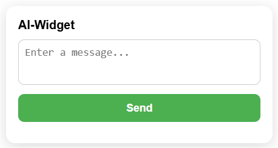

# snapwidget


## How to start:
* Run FastAPI-server:
```bash
uvicorn main:app --reload
```

* Run HTTP-server:
```bash
python -m http.server 3400
```

Open **ai-client.html** in browser.

## Content:

* **client.html** with **widget.js**
* **ai-client.html** with **ai-widget.js**


## How to use:

Add this code to your website page:
```html
<div id="ai-snapwidget" pub-api-key="3ff02d50-daaa-5d71-b193-dad394878051" api-url="http://example.com"></div>
<script src="http://example.com:8000/static/ai-widget.js"></script>
```
**NOTICE:** pub-api-key should be generated for each client personally.

## UI/UX on site
<p align="left">
  
</p>
